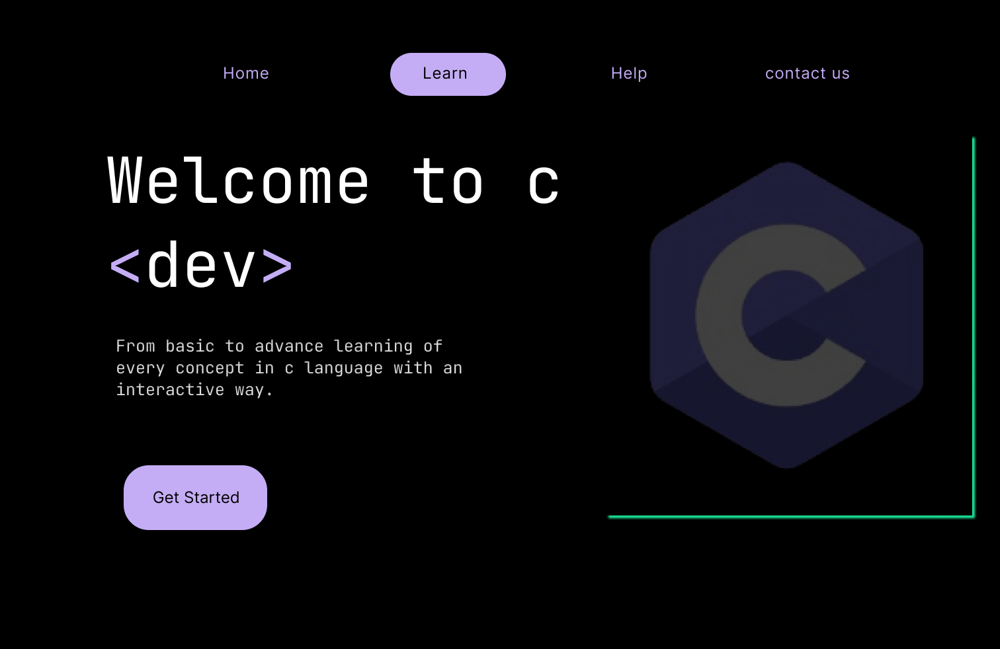
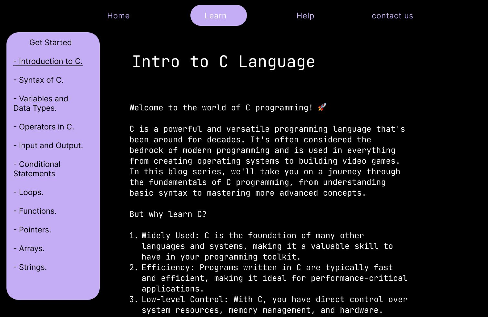
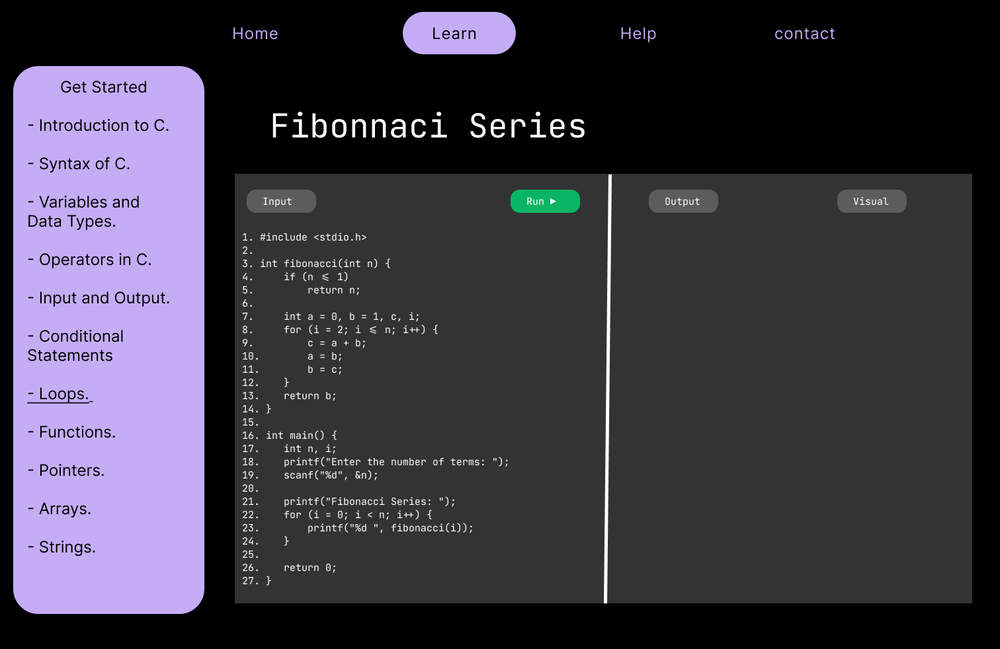
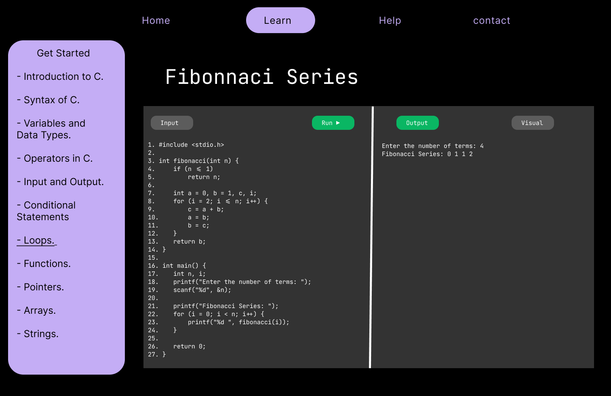
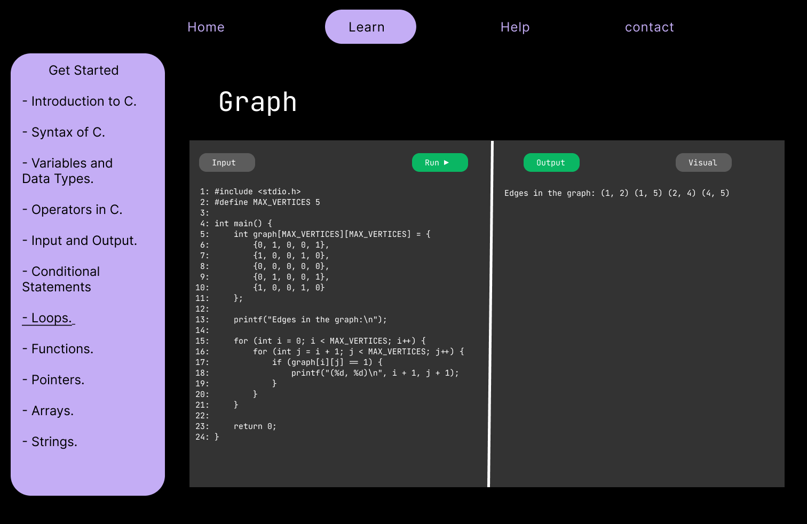
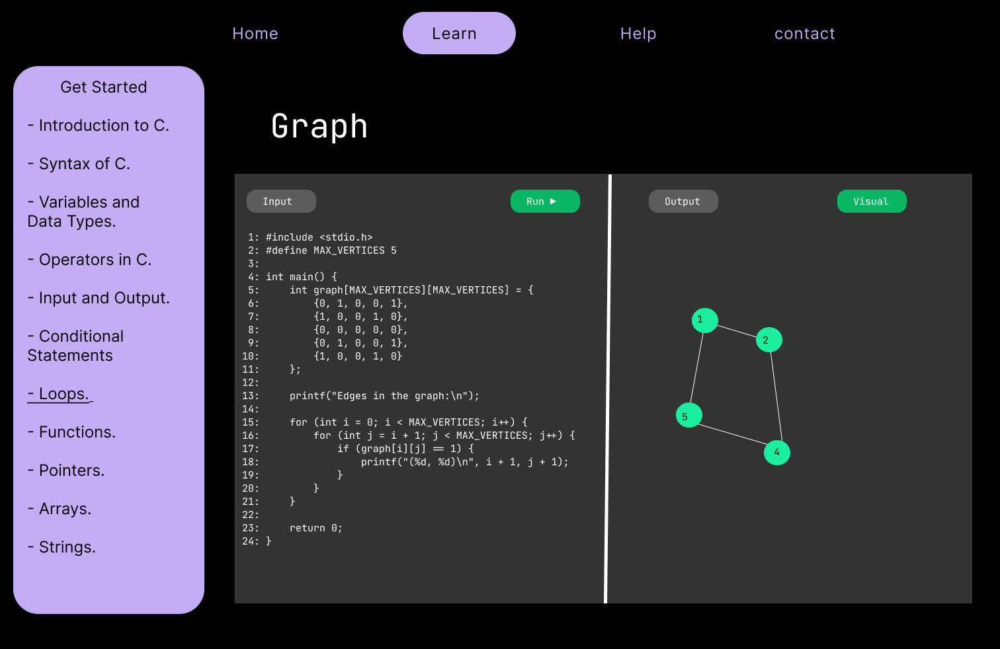

# Project Title



## Table of Contents

- [Introduction](#introduction)
- [Installation](#installation)
- [Usage](#usage)
- [Features](#features)
- [Contributing](#contributing)
- [License](#license)

## Introduction

Our project aims to provide an User interactive way to visuallize code of any programming language in tabuler,stack,and graphical ways so user can understand programming language more easily and efficiencly

## Features

HomePage:-

This page gives basic introduction to cource

Introuction:-

This page startes giving description to cource

Examples:-





## Installation

Include our project in your system and start creating your own visualization platform

```bash
git clone https://github.com/sohamsinh31/DotSlash7.git
